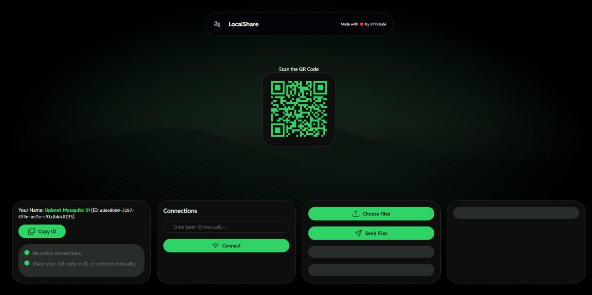

# LocalShare

LocalShare is a peer-to-peer file-sharing web app that was built entirely with vanilla HTML, CSS, and JS.

## Getting Started

You can clone LocalShare using Git.

```bash
git clone https://github.com/Infinitode/LocalShare.git
cd LocalShare
```

Or view and use the live web demo, at https://local-share.netlify.app/.

*Live demo:*

[](https://local-share.netlify.app/)

## Features

- **Peer to peer file sharing**: LocalShare shares files directly between devices on the same network.
- **No server required**: No need for a central server, making it easy to use and set up.
- **Simple UI**: Easy to use interface.
- **Open Source**: The project is open source, allowing for community contributions and transparency.

## Contributing

Contributions are welcome! If you encounter any issues, have suggestions, or want to contribute to LocalShare, please open an issue or submit a pull request on [GitHub](https://github.com/infinitode/LocalShare).

## License

LocalShare is released under the terms of the **MIT License (Modified)**. Please see the [LICENSE](https://github.com/infinitode/LocalShare/blob/main/LICENSE) file for the full text.

**Modified License Clause**

The modified license clause grants users the permission to make derivative works based on the LocalShare software. However, it requires any substantial changes to the software to be clearly distinguished from the original work and distributed under a different name.
